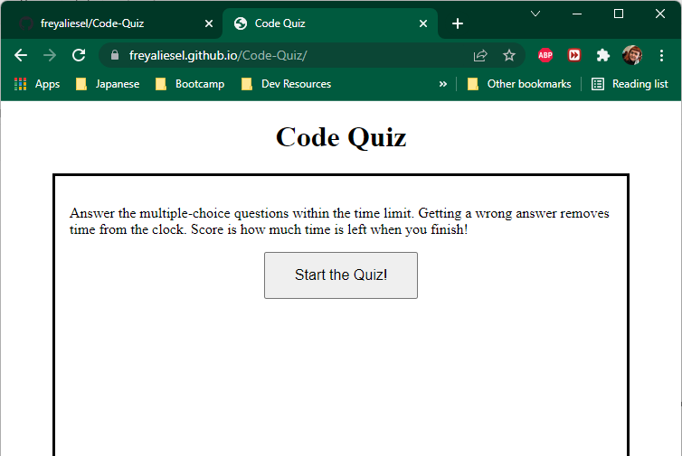

# Week 4 Homework - Code Quiz

Assignment is to create a page from scratch that fulfills the following criteria.

> ### User Story
> ```
> AS A coding bootcamp student
> I WANT to take a timed quiz on JavaScript fundamentals that stores high scores
> SO THAT I can guage my progress compared to my peers
> ```
>
> ### Acceptance Criteria
>```
> GIVEN I am taking a code quiz
> WHEN I click the start button
> THEN a timer starts and I am presented with a question
> WHEN I answer a question
> THEN I am presented with another question
> WHEN I answer a question incorrectly
> THEN time is subtracted from the clock
> WHEN all questions are answered or the timer reaches 0
> THEN the game is over
> WHEN the game is over
> THEN I can save my initials and my score
>```


Program is on [github](https://github.com/freyaliesel/Code-Quiz)


